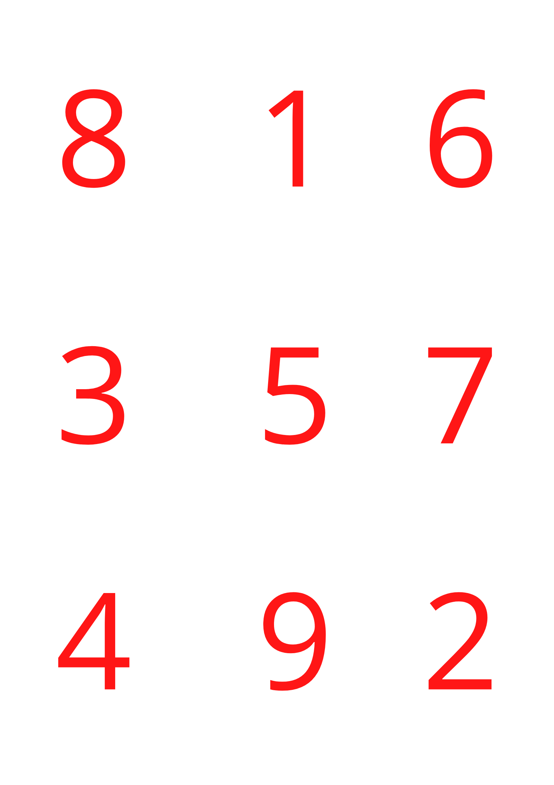

# Title

Fifteen

# Metadata

## Type

game

# Main Version

## Statement

This is a game for two players (or a group split into two teams). Take the A and 2 to 9 cards of any suit and place them face up in order. A = 1 in this game. Take it in turns to choose one of the cards and place it in front of you. The first player that has exactly three cards that add up to 15 is the winner. You can have more than three cards, but you only win if three of them add up to 15.

## Further Instructions

Remember you can't use two numbers to make 15, you can't use four numbers, it must be three numbers. You can have more than three cards in your hand and use only 3 of them. The game is a draw if all the cards have been chosen and nobody can make 15.

## Strategy tips

Write down all the combinations of three numbers that add up to 15. How can you be sure that you have found all the combinations? Which numbers appear in 2, 3, and 4 of these combinations?

Think about other games you might have played that this is similar to. Is it an advantage to go first or second?

# Extension 1

## Statement

Try playing the game again, but with the cards arranged like this to start with. 

What do you notice about the way the numbers are arranged? Does it remind you of any other game?

# Additional information

## About

This game is interesting because it is the same as the game tic-tac-toe/naughts and crosses. The technical term for this is *isomorphic*. In mathematics it is often helpful, when faced with a new problem, to relate it to one you already know how to solve.

## References

* https://www.ms.uky.edu/~lee/ma310sp15/gameoffifteen.pdf

* https://en.wikipedia.org/wiki/Number_Scrabble

