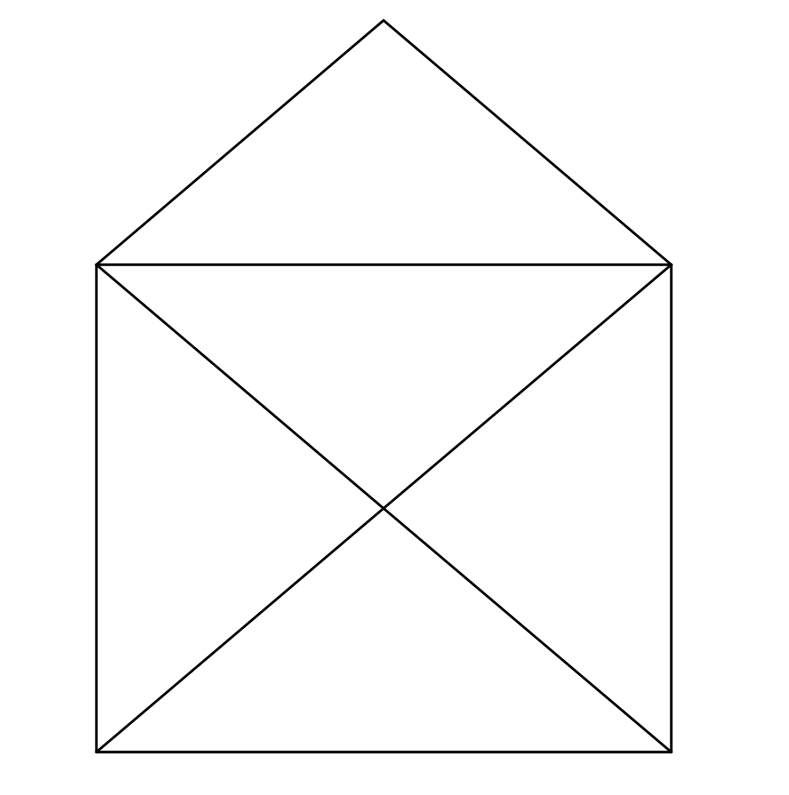
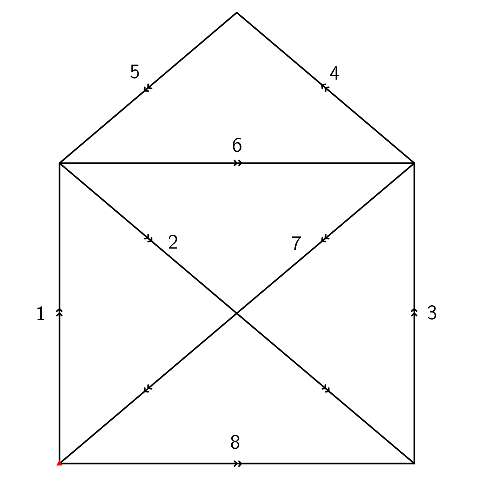
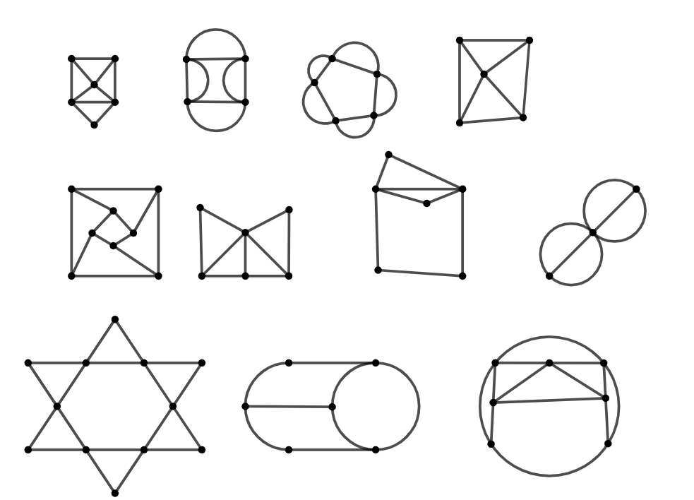

# Title

House

# Metadata

## Type

puzzle

# Main Version

## Statement

From how many vertices (points) is it possible to draw this figure without lifting the pen from the paper and going through each line exactly once?

## Correct Answer

2

## Hint

Try starting from the bottom left vertex (point).

## Explanation

We can draw the figure in one uninterrupted movement if we start at the bottom left (or bottom right) vertex. For example starting at the bottom left we travel along edges 1 to 8:

This kind of path is called an Euler path, and it is called an Euler circuit if it starts and ends in the same point. The degree of a vertex is the number of edges joining onto that vertex, and vertices are said to be odd or even according to whether the degree is odd or even. Euler circuits exist only in networks where there are no odd vertices, that is where all the vertices have an even number of edges ending there.

Two edges are used each time the path visits and leaves a vertex because the circuit must use each edge only once. It follows that if the graph has an odd vertex then that vertex must be the start or end of the path and, as a circuit starts and ends at the same vertex, for a circuit to exist all the vertices must be even. When there are two odd vertices a walk can take place that traverses each edge exactly once but this will not be a circuit.

Can you think why it is impossible to draw any graph with an odd number of odd vertices (e.g. one odd vertex)? Well the reason is that each edge has two ends so the total number of endings is even, so the sum of the degrees of all the vertices in a graph must be even, so there cannot be an odd number of odd vertices.

# Extension 1

## Statement

From how many vertices (points) is it possible to draw this figure by an uninterrupted movement of the pen, going through each line exactly once?

## Hint

Start with the top vertex. Once you have followed each line, where do you end up? Can you make use of this information to find out where else you could start?

## Correct Answer

7

## Explanation

If you start with the point at the top, you will notice that after following all the lines, you end up at the start again. But this means you went in a loop! So you can start anywhere along this loop and simply follow the lines the same way you did before, and you will end up where you started. This means you can start from any of the vertices and visit all lines. 

# Extension 2

## Statement

Remember that an Euler Path visits every edge once, and an Euler circuit does the same but starts and ends in the same point. How many of these graphs are Euler circuits?

## Hint

Look to see how many nodes have an odd number of edges.

## Correct Answer

4

## Explanation

If there are no odd nodes or if there are two odd nodes, that means that the network is traversable. Graphs with only two odd nodes are in an Euler path and graphs with no odd nodes are in an Euler circuit. 2, 3, 7 and 9 have no odd nodes so they are the four graphs with Euler circuits.

# Additional information

## About

A version of this problem was originally solved by Leonard Euler. In a city consisting of 4 islands linked by bridges, the people of the town wondered if it was possible to go for a walk and cross each bridge exactly once. Euler solved this problem first by simplifying it with a vertex for each island, and a line between two vertices for each bridge to get a drawing like in this puzzle. In this way the study of Topology was born. The second extension gives lots of practice looking for Euler circuits and was taken from the brilliant NRICH website.

## References

* https://en.wikipedia.org/wiki/Seven_Bridges_of_K%C3%B6nigsberg

* https://www.transum.org/Maths/Activity/without/

* https://datagenetics.com/blog/december22018/index.html

* https://nrich.maths.org/2326

* https://www.youtube.com/watch?v=W18FDEA1jRQ

